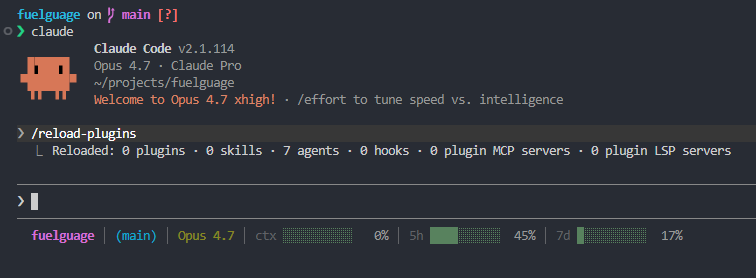

```
▄▄▄▄▄▄▄▄▄▄▄▄▄▄▄▄▄▄▄▄▄▄▄▄▄▄▄▄▄▄▄▄▄▄▄▄▄▄▄▄▄▄
█░▄▄█░██░█░▄▄█░████░▄▄▄█░▄▄▀█░██░█░▄▄▄█░▄▄
█░▄██░██░█░▄▄█░████░█▄▀█░▀▀░█░██░█░█▄▀█░▄▄
█▄████▄▄▄█▄▄▄█▄▄███▄▄▄▄█▄██▄██▄▄▄█▄▄▄▄█▄▄▄
▀▀▀▀▀▀▀▀▀▀▀▀▀▀▀▀▀▀▀▀▀▀▀▀▀▀▀▀▀▀▀▀▀▀▀▀▀▀▀▀▀▀
```

[](https://claude.com/claude-code)
[](https://docs.claude.com/en/docs/claude-code/plugins)
[](.claude-plugin/plugin.json)
[](https://opensource.org/licenses/MIT)

[](#requirements)
[](#requirements)
[](#requirements)
[](#requirements)
[](scripts/statusline.sh)
[](scripts/statusline.ps1)
[](#requirements)

>Una barra de estado multiplataforma para Claude Code que muestra la carpeta, la rama de git y barras de progreso con código de color para el uso de contexto, 5 horas y 7 días.

```
my-project | (main) │ ctx ███░░░░░░░  28% │ 5h █████░░░░░  47% │ 7d ██░░░░░░░░  19%
```

Verde por debajo del 70%, amarillo del 70 al 89%, rojo a partir del 90%.

## Demostración



## ¿Por qué?

Los límites de velocidad de Claude Code son por cada 5 horas y por cada 7 días. Exceder tu presupuesto semanal sin darte cuenta es un problema real; esto lo mantiene siempre a la vista.

## Instalación

```
/plugin marketplace add adityaarakeri/fuelgauge
/plugin install fuelgauge
/fuelgauge:setup
```

Reinicia Claude Code después de la configuración.

## Requisitos

- **macOS / Linux / WSL**: `jq` y `git`
- **Windows (PowerShell nativo)**: `git` en la ruta (PATH), PowerShell 5.1 o 7+
- **Claude Code v1.2.80+** para las barras de 5h/7d (las versiones anteriores mostrarán `0%` en las barras de uso)

## ¿Esto consume tokens o afecta los límites de velocidad?

No. La barra de estado se ejecuta localmente, lee datos que Claude Code ya posee y no realiza llamadas a la API. Las actualizaciones se limitan a un máximo de cada 300 ms y solo se activan cuando se actualizan los mensajes de la conversación.

## Desinstalación

```
/fuelgauge:uninstall
/plugin uninstall fuelgauge
```

## Configuración manual (sin usar el comando slash)

Agrega lo siguiente a `~/.claude/settings.json`:

**Unix:**
```json
{
  "statusLine": {
    "type": "command",
    "command": "${CLAUDE_PLUGIN_ROOT}/scripts/statusline.sh",
    "padding": 0
  }
}
```

**Windows:**
```json
{
  "statusLine": {
    "type": "command",
    "command": "powershell -NoProfile -ExecutionPolicy Bypass -File \"${CLAUDE_PLUGIN_ROOT}\\scripts\\statusline.ps1\"",
    "padding": 0
  }
}
```

## Licencia

MIT
```
