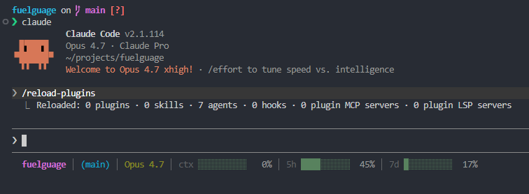

```
▄▄▄▄▄▄▄▄▄▄▄▄▄▄▄▄▄▄▄▄▄▄▄▄▄▄▄▄▄▄▄▄▄▄▄▄▄▄▄▄▄▄
█░▄▄█░██░█░▄▄█░████░▄▄▄█░██░█░▄▄▀█░▄▄▄█░▄▄
█░▄██░██░█░▄▄█░████░█▄▀█░██░█░▀▀░█░█▄▀█░▄▄
█▄████▄▄▄█▄▄▄█▄▄███▄▄▄▄██▄▄▄█▄██▄█▄▄▄▄█▄▄▄
▀▀▀▀▀▀▀▀▀▀▀▀▀▀▀▀▀▀▀▀▀▀▀▀▀▀▀▀▀▀▀▀▀▀▀▀▀▀▀▀▀▀
```

>A cross-platform Claude Code status line with folder, git branch, and color-coded progress bars for context, 5-hour, and 7-day usage.

```
my-project | (main) │ ctx ███░░░░░░░  28% │ 5h █████░░░░░  47% │ 7d ██░░░░░░░░  19%
```

Green under 70%, yellow 70–89%, red at 90%+.

## Demo



## Why?

Claude Code's rate limits are per-5h and per-7d. Blowing through your weekly budget without noticing is a real problem this keeps it in your face.

## Install

```
/plugin marketplace add adityaarakeri/fuelguage
/plugin install fuelguage
/fuelguage:setup
```

Restart Claude Code after setup.

## Requirements

- **macOS / Linux / WSL**: `jq` and `git`
- **Windows (native PowerShell)**: `git` on PATH, PowerShell 5.1 or 7+
- **Claude Code v1.2.80+** for 5h/7d bars (older versions will show `0%` for usage bars)

## Does this cost tokens or hit rate limits?

No. The status line runs locally, reads data Claude Code already has, and makes zero API calls. Updates are throttled to at most every 300ms and only fire when conversation messages update.

## Uninstall

```
/fuelguage:uninstall
/plugin uninstall fuelguage
```

## Manual setup (without the slash command)

Add to `~/.claude/settings.json`:

**Unix:**
```json
{
  "statusLine": {
    "type": "command",
    "command": "${CLAUDE_PLUGIN_ROOT}/scripts/statusline.sh",
    "padding": 0
  }
}
```

**Windows:**
```json
{
  "statusLine": {
    "type": "command",
    "command": "powershell -NoProfile -ExecutionPolicy Bypass -File \"${CLAUDE_PLUGIN_ROOT}\\scripts\\statusline.ps1\"",
    "padding": 0
  }
}
```

## License

MIT
